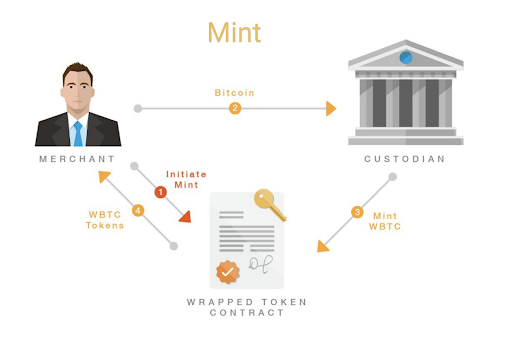
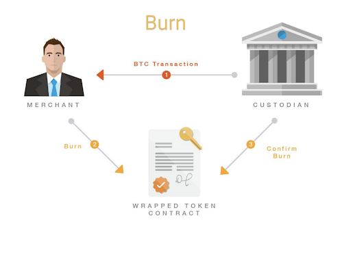
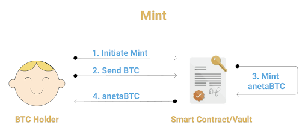
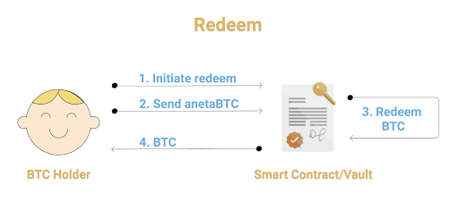

Below is the current wBTC implementation controlled by custodian BitGo. These diagrams are referenced from the original wBTC whitepaper, which was developed by our partners, Kyber Network. 

<!-- insert image here -->

wBTC protocol diagram showing the process of minting and burning tokens with a custodian.

Final stage of wBTC reaching the end customer.

For the wBTC protocol, either minting BTC or confirming the burn of tokens is at the full control of the custodian, which in this case, is BitGo. They are solely responsible for oversight of the locked Bitcoin.

As noted in the top-left diagram, the merchant must send their Bitcoin directly to the custodian. The custodian then mints the wBTC after receiving the user’s Bitcoin and the corresponding wBTC will be sent to the user.

For burning tokens, the custodian sends the original Bitcoin back to the user and the contract performs the burn of wBTC, and is confirmed and finalized by the custodian.

As you can see, the custodian is in full control of the user’s Bitcoin.

In the case of anetaBTC, Bitcoin is sent to a non-custodial vault that securely stores the Bitcoin through smart contracts.

Below is the anetaBTC implementation that is facilitated by non-interactive smart contracts.

anetaBTC protocol diagram of minting anetaBTC and locking BTC using non-custodial, non-interactive Ergo smart contracts.

In the case of anetaBTC, instead of users sending Bitcoin to a custodian, it is sent to a vault that is a smart contract that stores the Bitcoin, mints anetaBTC, and then sends the anetaBTC to the connected wallet.

For redeeming BTC, users simply initiate the redeem and send their anetaBTC back to the vault and the smart contract will release the Bitcoin back to the user when it successfully confirms receiving anetaBTC.

The user will request to issue or redeem anetaBTC and the anetaBTC database will relay which function the user is trying to perform and send that request to the anetaBTC bridge. From there, the anetaBTC bridge will send that information to anetaBTC-stats where the events will be written to the official anetaBTC events database and read the information back to anetaBTC-stats.

The diagram also shows that when the user makes the initial request, data is also sent from the dashboard to anetaBTC-stats, and then later confirmed with events information.

Additionally, there is a relay chain that is connected to the Bitcoin blockchain that communicates with the anetaBTC bridge. The relay chain sends the user's Bitcoin to the anetaBTC bridge which has an incorporated Bitcoin wallet where the user’s assets are held.

The anetaBTC bridge also communicates with the Ergo node and relays information directly to the Ergo blockchain. During this, the anetaBTC bridge will execute the issue or redeem the desired asset and send the token to the user directly from the vault.
To issue BTC, the user will be required to pay a security deposit in ERG, hence why the vault sends locked ERG collateral to the anetaBTC bridge. This is a security measure to incentivize genuine activity and prevent griefing of vaults. The ERG security deposit will be released backed to the user for completed transactions.

If the Bitcoin holder does not successfully send the BTC to the vault in time, the vault can cancel the issue request and receive the ERG collateral from the user.
