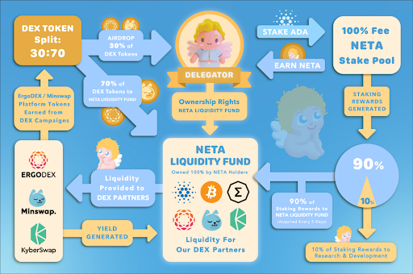

# LISO - FAQ

### What is a Liquidity ISO (LISO)?

A Liquidity Initial Stake Pool Offering (LISO) is our version of an ISO.

Through our LISO, delegators will be airdropped cNETA tokens by staking with NETA1 and NETA2 stake pools on Cardano.

The anetaBTC LISO has 3 purposes:

    1. Distribute cNETA (anetaBTC governance and profit sharing tokens) to the community in a fair and wide manner

    2. Provide valuable liquidity to our DEX partners: ErgoDEX, Minswap, and Kyberswap

    3. Establish and grow the NETA Liquidity Fund - a compounding group of assets owned 100% by NETA/cNETA holders

### What is the NETA Liquidity Fund?

The NETA Liquidity Fund is a compounding group of assets owned 100% by NETA/cNETA holders - established and grown by mining rewards generated from NETA1 and NETA2 stake pools.

This Fund, as efficiently as possible, will be used to provide valuable liquidity to our DEX partners: ErgoDEX, KyberSwap, and Minswap. The Fund should generate yield on its assets and earn ErgoDEX/Minswap platform tokens as well.

Yield and ErgoDEX/Minswap tokens earned by the NETA Liquidity Fund will directly benefit all NETA/cNETA holders, supplementing and diversifying the base value of NETA/cNETA tokens (the governance and profit sharing tokens of the anetaBTC protocol).

As mining rewards are generated every 5 days by NETA1 and NETA2 stake pools, the Fund will acquire, in approximate values:

 * BTC (30%)
 * ADA (15%)
 * ERG (15%)
 * MIN (15%)
 * KNC (15%)
 * NETA/cNETA (10%)

### How much cNETA will I earn if I delegate?

Delegators to NETA1 and NETA2 stake pools will earn a base minimum of 6 cNETA tokens per epoch for each 1,000 ADA they have delegated.

Active giveaway events for NETA1 and NETA2 delegators:

* Next giveaway events will be announced soon.

Past giveaway events for NETA1 and NETA2 delegators:

* Delegate for 2 months consecutively and be airdropped 500 cNETA for each 1000 ADA delegated. (Deadline passed)

* Delegate in the first epoch of the Liquidity ISO (epoch 318) and be airdropped 1000 cNETA for each 1000 ADA delegated. (Deadline passed)

### What giveaway events for NETA1 and NETA2 delegators are currently active?

Next giveaway events will be announced soon.

Past giveaway events for NETA1 and NETA2 delegators:

* Delegate for 2 months consecutively and be airdropped .5 cNETA for each 1 ADA delegated. (Active - Deadline for this event will be announced soon)
Past giveaway events for NETA1 and NETA2 delegators:

* Delegate in the first epoch of the Liquidity ISO (epoch 318) and be airdropped 1 cNETA for each 1 ADA delegated. (Deadline passed)

### How do I earn ErgoDEX and Minswap tokens?

The NETA Liquidity Fund will be used to provide liquidity to our DEX partners: ErgoDEX, Minswap, and KyberSwap.

In addition to generating yield on its assets, the Fund will earn ErgoDEX/Minswap platform tokens from early user campaigns.

All holders of NETA/cNETA, including non-delegators, will receive these DEX token in various airdrops. Delegators of NETA1 and NETA2 stake pools will be airdropped 3x the amount of DEX tokens as NETA/cNETA holders who are not delegating, proportional to their ownership interest.

### What are the benefits of holding NETA/cNETA?

Holders of NETA and cNETA collectively have the following benefits:

 * 100% Governance of the anetaBTC protocol;
 * 100% Revenue-sharing of all protocol transaction fees;
 * 100% Ownership of NETA Liquidity Fund via LISO; 

As anetaBTC is a Decentralized Autonomous Organization (DAO). Any majority vote of anetaBTC governance tokens, NETA and cNETA, will dictate the future direction of the anetaBTC protocol, including the ability to liquidate the NETA Liquidity Fund into the hands of all NETA holders, proportional to their ownership interest.

### How long will anetaBTC LISO pools be open for delegation?

anetaBTC LISO pools will run until 500 million cNETA is distributed, or 25% of total supply of NETA/cNETA.

### What are the official NETA stake pools? (Pool ID's)

 * NETA1 Pool ID: pool17h6slydr6rd9vquqa38p5cf9xqnpc24w6a99rhllcjzljgugx6x
 * NETA2 Pool ID: pool15hx9hze8ulcsw6e7ceelz2pem2g3u9c29wqe4eszkhspj3wcdlx

### When does staking to NETA stake pools become available?

NETA1 and NETA2 stake pools are live and accepting delegations.

### Is there a visual breakdown of the LISO?

Yes!

