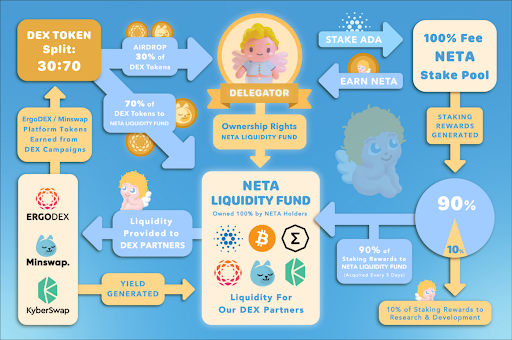

# Liquidity Initial Stake Offering (LISO)

An Initial Stake Pool Offering (ISO), traditionally, is a method to distribute a protocol’s tokens to the community utilizing the Cardano blockchain’s Proof-of-Stake mechanism. This mechanism incentivizes nodes supporting the Cardano blockchain to build out a decentralized network of servers across the globe.

Through our LISO, a total of 15% of the total NETA/cNETA supply, or 300,000,000 cNETA, will be available to be airdropped to delegators of our NETA stake pools with the ticker symbols NETA1 and NETA2. The block minting reward fee is 99% and for each epoch, we will airdrop at least 6 cNETA tokens for each 1,000 ADA delegated.

For instance, if you delegate:
* 3,000 ADA → 18 cNETA per epoch will be airdropped;
* 5,000 ADA → 30 cNETA per epoch will be airdropped;
* 10,000 ADA → 60 cNETA per epoch will be airdropped, and so on.

Additionally, to show our appreciation of our long-term supporters, those who stake with NETA pools for at least six (6) months will be airdropped additional cNETA.
To mitigate saturation, any delegation that brings the saturation of NETA pools to over 100% will not be airdropped cNETA.

Although proceeds from ISO’s have previously been used entirely for internal use, anetaBTC is deploying an overwhelming majority of all ADA earned from mining Cardano for the direct benefit of our community — all NETA/cNETA holders.

**NETA Liquidity Fund**

90% of all ADA earned by NETA stake pools will be injected into a 100% community-owned fund — the NETA Liquidity Fund.
cNETA and NETA token holders will collectively have 100% ownership rights of the NETA Liquidity Fund.
ADA rewards are earned every 5 days by NETA pools, and the Fund will acquire, in approximate values, BTC (30%), ADA (15%), ERG (and ErgoDEX platform token) (15%), MIN (15%), KNC (15%), and NETA/cNETA (10%).
These holdings, as efficiently as possible, will be used to provide liquidity to our DEX partners, ErgoDEX, KyberSwap, and Minswap, and should earn yield as a result.

Yield rewards will be reinvested back into the Fund to facilitate compound growth.
For any DEX campaigns from our Strategic Partners, ErgoDEX and Minswap, we will airdrop 30% of awarded DEX platform tokens to all NETA/cNETA holders based proportionally to their ownership interest, and 70% will be reinvested back into the Fund.

Delegators to verified NETA stake pools will receive a 3x bonus on any airdrops from DEX campaigns by our partners. This 3x bonus is an incentive for potential delegators to stake with us.

Below is a diagram explaining the flow of the Liquidity ISO.

