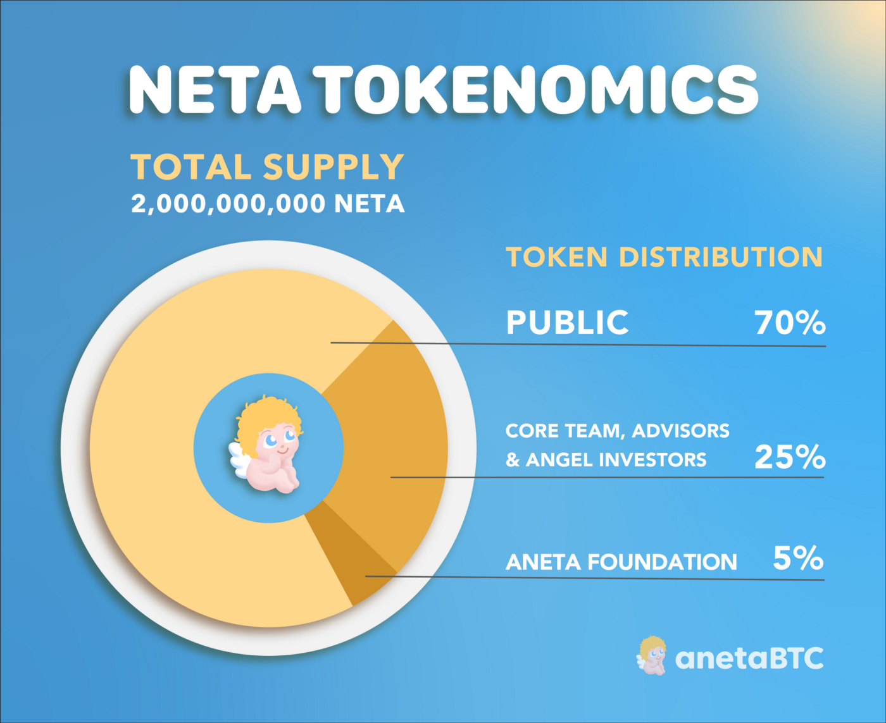

# Tokenomics

## NETA and cNETA

There are a combined total of two billion (2,000,000,000) anetaBTC protocol tokens and is hard-capped at this amount.

1,000,000,000 (50%) of these anetaBTC protocol tokens will be on Ergo as NETA, while another 1,000,000,000 (50%) of these anetaBTC protocol tokens will be on Cardano as cNETA. Combined, NETA and cNETA tokens represent a 100% governance and revenue-sharing stake for the entire anetaBTC protocol.

Each and every NETA and cNETA token has an equivalent stake in the anetaBTC protocol.

## Tokenomics

The total NETA allocation from largest to smallest is explained below:
 * Public: 70% (1,400,000,000 tokens)
 * Core Team, Advisors, Angel Investors: 25% (500,000,000 tokens)
 * Aneta Foundation: 5% (100,000,000 tokens)
 

## Public Distribution

A total 70% (1,400,000,000 tokens) of the total NETA supply will be for public distribution, and the breakdown of this category is explained below.

 * To Be Announced: 59% (1,180,000,000 tokens)
 * Ergo Development DAO: 5% (100,000,000 tokens)
 * Community Airdrop Fund: 5% (100,000,000 tokens)
 * Community Team Fund: 1% (20,000,000 tokens)

## To Be Announced

This remaining public distribution will be allocated in various ways, primarily for the benefit of NETA holders. Announcements will be made in the coming weeks in regard to this.

## Ergo Development DAO

We are donating 5% of the total NETA supply to the Ergo Development DAO, a community-funded initiative led by the Ergo Foundation to provide resources for the growth of the Ergo ecosystem.
To allow our decentralized ecosystem to flourish for the long-term, our goal is to contribute to this effort led by the Ergo Foundation in creating a self-sustaining resource, which will provide a means to fund projects that will hopefully have a positive impact on future generations.

## Community Airdrop Fund

The Community Airdrop Fund (CAF) has been live for over a month, and we have begun to airdrop the first NETA tokens to our community members.
We are thrilled to see NETA tokens have already been distributed to our community members throughout the world, including: Argentina, Brazil, Germany, India, Indonesia, Italy, Malaysia, Nigeria, Philippines, Poland, Russia, Singapore, Uganda, and many, many more.
So far, NETA tokens have been distributed to all winners of the meme and infographic contests along with those who won the NFT and Twitter Spaces giveaways.
The NETA tokens allocated for the CAF will continue being distributed over time. Thus far, 72% of the CAF has been allotted, including a combined 20,000,000 anetaBTC platform tokens to be airdropped to the first users of ErgoDEX and Minswap.

## Community Team Fund
We have allocated a total of 1.0% of the total NETA supply to the Community Team Fund where we encourage our community members to join us in building anetaBTC and growing our global community.
Roles include community managers, ambassadors, and developers.
We will release more information on this as our team expands.

## Aneta Foundation
The Aneta Foundation is a non-profit organization. The primary focus of the Aneta Foundation is to contribute to educational causes throughout the world — with a primary focus of contributing to Khan Academy.
Khan Academy is a non-profit educational organization created by Sal Khan. Khan Academy’s mission is to provide a free, world‑class education for anyone, anywhere.
